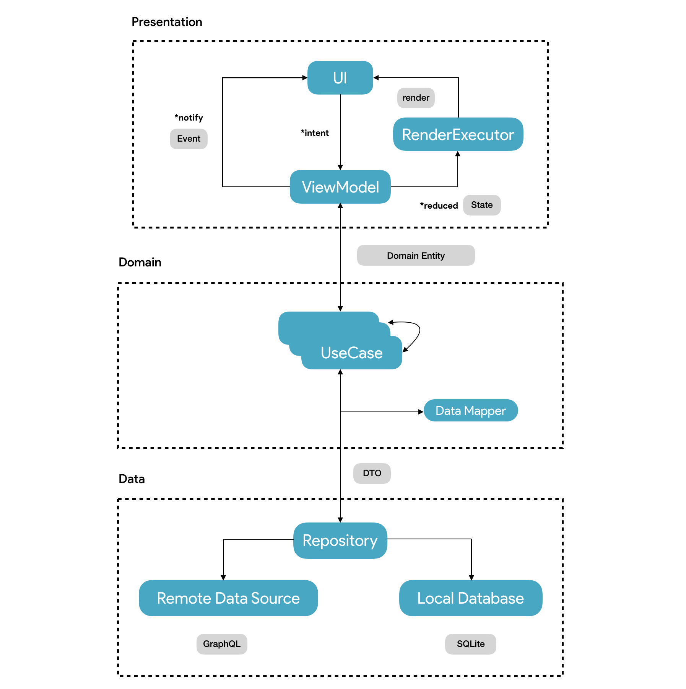

<p align="center" style="margin: 0;">
    
</p>

<h4 align="center" style="margin: 0;">
    *BA DUM TSSS*
</h4>

<p align="center" style="margin: 0;">
    
</p>

<p align="center" style="margin: 16px;">
    <a href="">
        
    </a>
    <a href="">
        
    </a>
    <a href="https://app.fossa.com/projects/git%2Bgithub.com%2FErickSumargo%2FDads?ref=badge_small">
        
    </a>
</p>

<p align="center">
    Just an app with lame dad jokes content to fill up your day.
</p>

## MVP
<div style="display: flex;">
    <video width="360" height="420" controls>
      <source src="assets/demo.mp4" type="video/mp4">
    </video>
    <div>
        <p><b>This MVP version features:</b></p>
        <ul>
            <li>Feed walks you through the latest dad jokes.</li>
            <li>Browse back seen jokes & share your favorite ones!</li>
            <li>Notification to remind you up with latest available jokes.</li>
            <li>Light/Dark theme based on preference.</li>
        </ul>
    </div>
</div>

## Architecture
Dads adopts [MVVM](https://en.wikipedia.org/wiki/Model%E2%80%93view%E2%80%93viewmodel) with [Unidirectional flow (UDF)](https://en.wikipedia.org/wiki/Unidirectional_Data_Flow_(computer_science)) pattern.
<br/>
<br/>
Moreover, view components are rendered based on their related changed states only performed by diff-state engine, so the render operation is done more **efficiently**.
[]()

## Design Principles
- [Elegant Objects (EO)](https://www.elegantobjects.org/),
- [S.O.L.I.D](https://en.wikipedia.org/wiki/SOLID),
- [The Clean Architecture](https://blog.cleancoder.com/uncle-bob/2012/08/13/the-clean-architecture.html),
- Behavior testing driven with `ViewModel` as the sole SUT [(Very recommended talk)](https://www.youtube.com/watch?v=EZ05e7EMOLM).

## Stacks
#### Foundation
- [App Startup]() - XXX
- [Coroutines]() - XXX
- [Dagger Hilt]() - XXX
- [Flow]() - XXX
- [Fragment]() - XXX
- [Lifecycle]() - XXX
- [Navigation component]() - XXX
- [Room]() - XXX
- [View Binding]() - XXX
- [ViewModel]() - XXX
- [WorkManager]() - XXX

#### UI
- [Appcompat]() - XXX
- [BottomSheetDialogFragment]() - XXX
- [ConcatAdapter]() - XXX
- [ConstraintLayout]() - XXX
- [Lottie]() - XXX
- [Material Components]() - XXX
- [MotionLayout]() - XXX
- [ViewPager2]() - XXX

#### Internal
- [LiveListAdapter](https://www.apollographql.com/docs/android/) - XXX

#### Remote
- [Apollo GraphQL](https://www.apollographql.com/docs/android/) - XXX
- [OkHttp](https://square.github.io/okhttp/) - XXX

#### Testing
- [JUnit 5](https://junit.org/junit5/docs/current/user-guide/) - XXX
- [Truth](https://truth.dev/) - XXX

#### Health
* [Firebase Crashlytics]() - XXX 
* [LeakCanary](https://square.github.io/leakcanary/) (Debug) - XXX
* [StrictMode](https://developer.android.com/reference/android/os/StrictMode) (Debug) - XXX
<br/>
<br/>

## MAD Scorecard
[](https://madscorecard.withgoogle.com/scorecards/3887241481/)
<br/>
<br/>

[]()
## GraphQL Engine
Jokes are requested from proprietary GraphQL service, the [Dads-Engine](https://github.com/ErickSumargo/Dads-Engine). Check it out 🔥
<br/>
<br/>

## Roadmap
[]()

## How to run
* Since this project employs GraphQL stack, you need to download the [schema](https://www.apollographql.com/docs/tutorial/schema/) first:
    * Go to hosted [GraphQL Playground](https://dads-engine.herokuapp.com/graphql),
    * Open tab `SCHEMA` at the right side. `DOWNLOAD` it,
    * Put the `schema.json` in directory: `libs/lib_api/src/main/graphql/com/bael/dads/lib/api/`,
    * Or you can run this command as alternative.
        ```
        ./gradlew downloadApolloSchema --endpoint="https://dads-engine.herokuapp.com" --schema="libs/lib_api/src/main/graphql/com/bael/dads/lib/api/schema.json"
        ```
* Replace `$JWT` placeholder in `AuthInterceptor.kt` with the key I've shared with you before (see **Contributing** section 👇).
* Have fun!

## Contributing
[Let's get in touch](https://twitter.com/SumargoErick) if you're interested in contributing. Fork it, submit your PR.<br/>
Also feel free to open new issue, feature request, or any kind of related support ❤️. 

## Licenses
[](https://app.fossa.com/projects/git%2Bgithub.com%2FErickSumargo%2FDads?ref=badge_large)